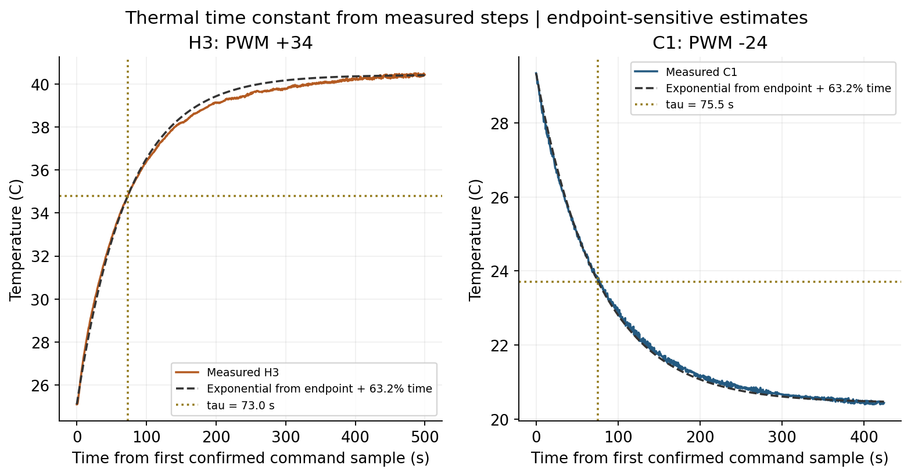
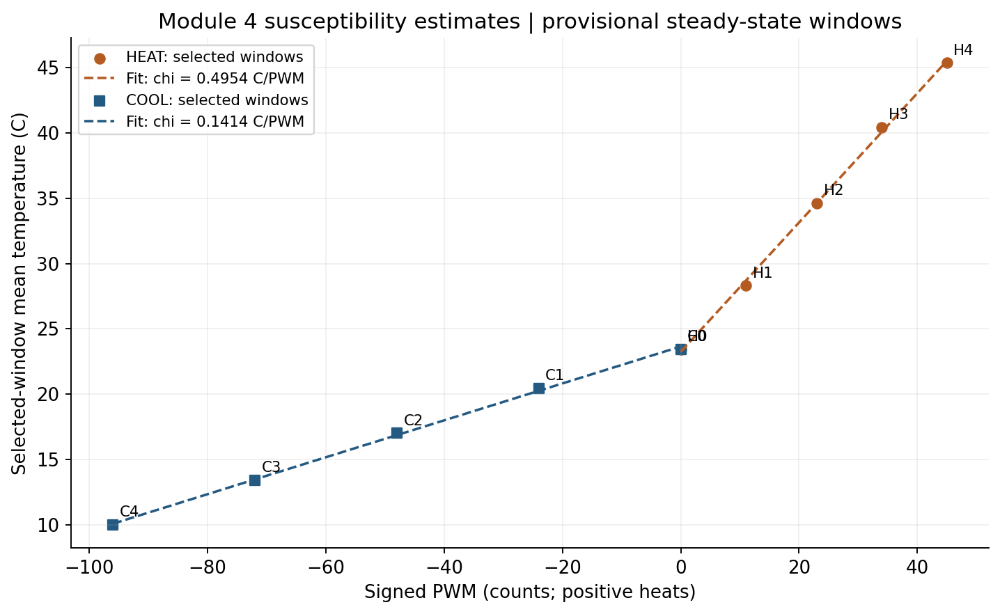
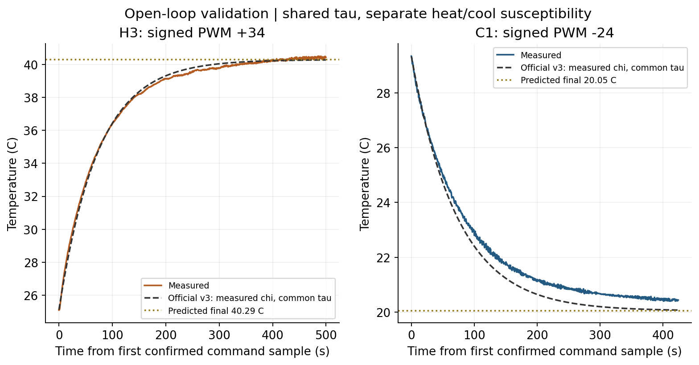
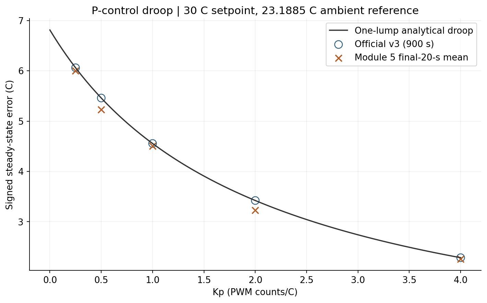
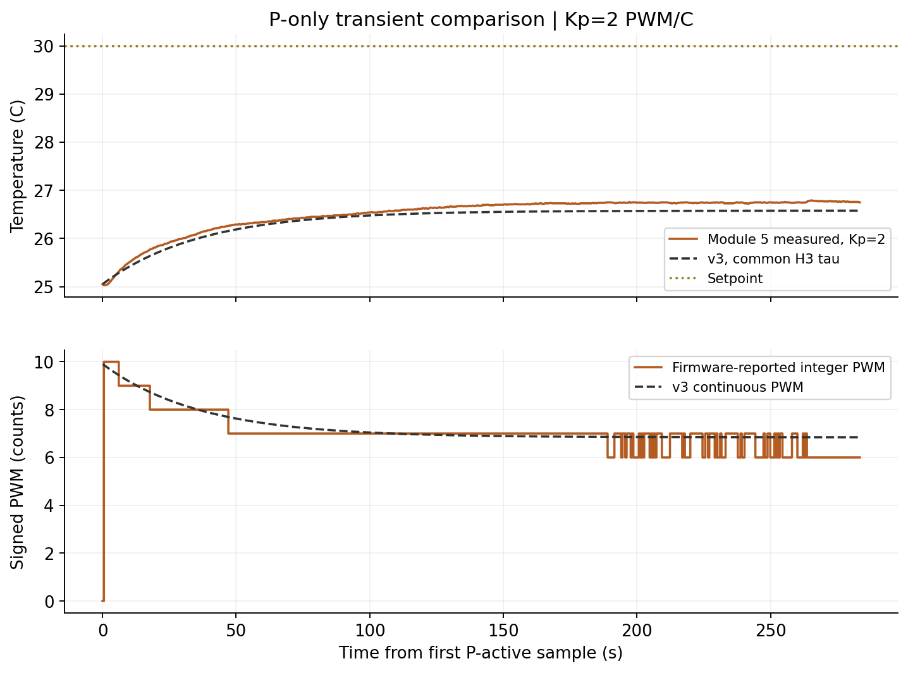
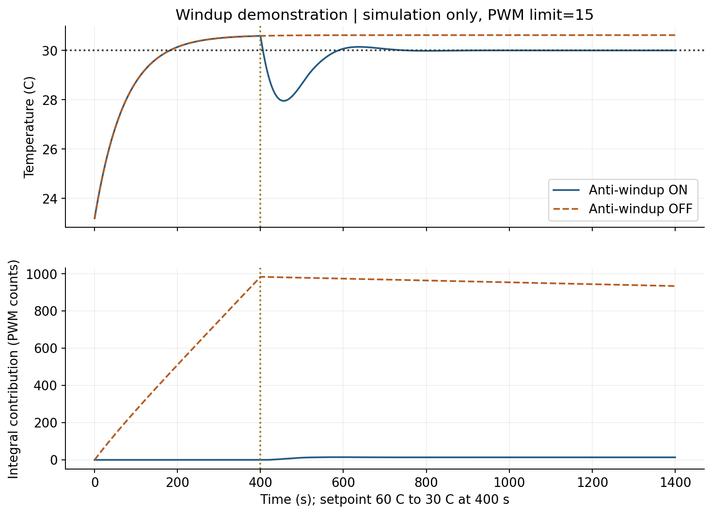

# Module 6, Part I: P/PI control and lumped modeling

Team: Ricky Huang and Xavier Zhu. Course: Phys 39, Module 6, Part I. This note collects the guided one-lump derivation, the numerical checks, and the simulation/analysis evidence for A3. Progress follows the [lab-06 assignment](https://sethfraden.github.io/Phys39F26-course/labs/lab-06/).

## Part 1: Algebraic droop model

### 1a. Derivation

The measured Module 4 open-loop steady-state relationship (signed PWM `u`, positive = heat) is

`T = T_amb + χ_{T,u} u`, where `χ_{T,u} = dT/du` is the signed-PWM susceptibility (°C/PWM count, positive).

P-only feedback supplies

`u = Kp (T_set − T)`.

Substitute the controller law into the open-loop relationship:

`T = T_amb + χ_{T,u} Kp (T_set − T)`.

At steady state, collect all terms containing `T`:

`(1 + χ_{T,u} Kp) T = T_amb + χ_{T,u} Kp T_set`.

Subtract this from `T_set` to isolate the droop:

`T_set − T = (T_set − T_amb) / (1 + χ_{T,u} Kp)`.

The product `L = χ_{T,u} Kp` is dimensionless — the steady-state loop gain. The numerator `e_0 = T_set − T_amb` is the initial error when the block starts at ambient. (Part 2 will derive `χ_{T,u} = P_u/H` from the dimensional one-lump balance.)

### 1b. Numerical check (one Module 5 gain sweep)

Measured inputs (2026-09-30 sweep, 30 °C heating setpoint):

- `χ_{T,u} = 0.4954 °C/PWM` (provisional Module 4 heating slope)
- `T_amb = 23.1885 °C`
- `T_set = 30.0 °C`
- `e_0 = T_set − T_amb = 6.8115 °C`

Detailed example, `Kp = 2 PWM/°C`:

- `L = 2 × 0.4954 = 0.9908`
- `predicted droop = 6.8115 / (1 + 0.9908) = 3.4215 °C`
- `predicted settled T = 30 − 3.4215 = 26.5785 °C`
- `measured droop = 3.2305 °C` (measured settled `T = 26.7695 °C`)
- difference = `−0.1910 °C` (the block settled slightly closer to the setpoint than predicted)

| Kp (PWM/°C) | L = Kp·χ | Predicted droop (°C) | Predicted settled T (°C) | Measured droop (°C) | Measured settled T (°C) | Measured − predicted (°C) |
| ---: | ---: | ---: | ---: | ---: | ---: | ---: |
| 0.25 | 0.124 | 6.0609 | 23.9391 | 6.0000 | 24.0000 | −0.0609 |
| 0.5 | 0.248 | 5.4593 | 24.5407 | 5.2300 | 24.7700 | −0.2293 |
| 1 | 0.495 | 4.5550 | 25.4450 | 4.5023 | 25.4977 | −0.0527 |
| 2 | 0.991 | 3.4215 | 26.5785 | 3.2305 | 26.7695 | −0.1910 |
| 4 | 1.982 | 2.2845 | 27.7155 | 2.2600 | 27.7400 | −0.0245 |

Measured droop decreases with gain and tracks the prediction to within 0.02–0.23 °C (a few hundredths of the full `e_0 = 6.81 °C`). Source values are in [`part_04_droop_comparison.csv`](../../Module_5/data/part_04_droop_comparison.csv) and the [Module 5 note](../../docs/module_notes/module_05_p_control.md).

### 1c. One physical reason the prediction differs

The model treats `χ_{T,u} = P_u/H` as one constant, but it is a local linearization. The Module 4 heating slope was fitted over the full 0–45 PWM range, whereas the Module 5 runs use only about 2–19 PWM near 24–28 °C, where `P_u` (TEC power per count) and `H` (passive conductance) are not exactly constant. The measured droop is consistently a little below the prediction (the block settles slightly closer to the setpoint), consistent with a locally different effective susceptibility in this low-PWM, near-ambient region. The final-20-s windows are also not a rigorous steady-state proof, which adds uncertainty.


## Part 2: dimensional energy balance and measured parameters

The First Law gives

\[
C\frac{dT}{dt}=P_u u-H(T-T_{\rm amb}).
\]

Here \(C\) is J/°C, \(P_u\) is W/PWM count, \(H\) is W/°C, and every term is W. Positive signed PWM heats; negative PWM cools. \(C=mc_p\). At constant command, setting the derivative to zero gives

\[
T_{\rm ss}=T_{\rm amb}+\frac{P_u}{H}u,
\quad\chi_{T,u}=\frac{P_u}{H},\quad\tau=\frac{C}{H}.
\]

Writing \(\theta=T-T_{\rm ss}\) gives \(\dot\theta=-\theta/\tau\), so \(\theta(t)=\theta(0)e^{-t/\tau}\). Equivalently,

\[
\frac{dT}{dt}=\frac{T_{\rm amb}+\chi_{T,u}u-T}{\tau}.
\]

Temperature differences have identical numerical values in °C and K. The available thermal measurements determine the ratios \(P_u/H\) and \(C/H\), not the three dimensional parameters separately.

### Integrated Module 5 interpretation questions

1. At a nonambient setpoint, P control commands zero power because its error is zero, but environmental heat exchange remains \(-H(T_{\rm set}-T_{\rm amb})\). Temperature therefore moves back toward ambient. A nonzero error must persist to provide the sustaining TEC command. Substitution of \(u=K_p(T_{\rm set}-T)\) gives the Part 1 droop equation. Agreement requires settled data, approximately constant directional susceptibility and ambient temperature, correct feedback sign, and unsaturated output. Integer PWM, changing thermal properties, and incomplete settling can cause disagreement.
2. \(\chi=P_u/H\) has units °C/PWM count. Doubling \(P_u\) doubles susceptibility; doubling \(H\) halves it; doubling \(C\) alone leaves susceptibility and settled droop unchanged while doubling the open-loop time constant. This is a ratio of coefficients, not actual steady heat rates, which balance.
3. The table below recomputes the heating branch using the unrounded slope. \(L\ll1\) is a small-loop-gain condition: 0.25 is the clearest small-gain run (L≈0.124); 0.5 is still below unity but L≈0.248 is less asymptotically small; Kp=1, 2, 4 have L≈0.495, 0.991, 1.982 and should not all be called small gain. Use χh for these heating runs, not χc.

| Kp (PWM/°C) | L | Measured droop (°C) | Predicted droop (°C) | Measured droop / initial offset | 1/(1+L) | Predicted τcl (s) |
| --- | --- | --- | --- | --- | --- | --- |
| 0.2500 | 0.1239 | 6.0000 | 6.0608 | 0.8809 | 0.8898 | 64.9790 |
| 0.5000 | 0.2477 | 5.2300 | 5.4592 | 0.7678 | 0.8015 | 58.5285 |
| 1.0000 | 0.4954 | 4.5022 | 4.5549 | 0.6610 | 0.6687 | 48.8332 |
| 2.0000 | 0.9909 | 3.2305 | 3.4213 | 0.4743 | 0.5023 | 36.6807 |
| 4.0000 | 1.9818 | 2.2600 | 2.2844 | 0.3318 | 0.3354 | 24.4912 |

All five experimental final-20-s droops agree with the provisional prediction to within approximately 0.025–0.229 °C. This is a calibration/model comparison, not a proof of final steady-state compliance.

## Part 3: time constant and its uncertainty

Use the first sample of the last contiguous constant-command segment as time zero, not the beginning of the CSV. Let the last 40 samples be an approximate endpoint. Find the first crossing of

\[
T_{63.2}=T_0+(1-e^{-1})(T_f-T_0)
\]

and interpolate between its adjacent samples. 63.2% is the exact exponential equivalent of the assignment's rounded 63% rule. Sampling is about 0.51 s. This is a first-crossing estimate, not a fitted exponential time constant. H2 starts after an earlier brief PWM-233 segment, so its preceding history is a further limitation.

| Run | Initial T (°C) | Endpoint mean (°C) | τ (s) | Endpoint sensitivity lower (s) | Endpoint sensitivity upper (s) | Enough duration for 3τ+60 s |
| --- | --- | --- | --- | --- | --- | --- |
| H1 | 21.8900 | 28.3105 | 68.2975 | 61.4707 | 70.0287 | False |
| H2 | 26.0400 | 34.6200 | 60.8599 | 60.2589 | 61.7084 | True |
| H3 | 25.1000 | 40.4205 | 73.0274 | 72.4868 | 73.7492 | True |
| C1 | 29.3400 | 20.4428 | 75.5013 | 75.1495 | 77.1148 | True |
| C2 | 22.6100 | 16.9887 | 65.7562 | 63.6055 | 68.5623 | True |
| C3 | 17.6700 | 13.4025 | 60.8585 | 60.7830 | 60.9240 | True |

H3 is the modeling reference: **τ = 73.03 s**, T0=25.10 °C, approximate endpoint=40.4205 °C, and threshold=34.7844 °C. Its confirmed +34 PWM segment begins at Arduino time 39.49 s and lasts 499.67 s. Endpoint min/max sensitivity gives approximately 72.49–73.75 s; this is **not a confidence interval**. Command-timing uncertainty, sensor calibration, thermal lag, non-exponential shape, and systematic drift are additional unquantified errors. Across the six runs, estimates range from 60.86 to 75.50 s; this range describes experiment/model variation, not a statistical error bar.

The Module 4 and 5 Arduino source both specify `SAMPLE_COUNT=1000` and average ADC voltage before temperature conversion, consistent with the assignment. The CSVs do not log the averaging count or the uploaded firmware hash, so this is source-code evidence rather than independent per-record proof.

H0/C0 and H4/C4 are excluded from time-constant estimation because there is no meaningful captured step or sufficient final-command duration. H1 still has endpoint drift and insufficient duration for 3τ+60 s. Having enough duration in other rows does not establish a noise/drift acceptance criterion. The [Module 4 protocol audit](../../docs/module_notes/module_04_open_loop_tec.md#revised-steady-state-protocol-audit) remains applicable.



## Part 4: official v3 open-loop comparison

The official v3 source is preserved unchanged at `Module_6/python/Lab_6_7_modeling_tec_v3.py`. Download URL and SHA256 are recorded in [`analysis_results.json`](../data/analysis_results.json).

From the five provisional points per direction, ordinary unweighted straight-line fits with free intercept give:

- χh = 0.49544629 °C/PWM count.
- χc = 0.14141667 °C/PWM count (cooling plotted against negative signed PWM).
- r = χh/χc = 3.503450.

The fitted intercepts and slope sensitivity after excluding each maximum endpoint are in [`susceptibility.csv`](../data/susceptibility.csv). The fit is provisional; five selected windows are not five independently validated equilibria.



For one-lump simulation, choose the **arbitrary normalization** H=1 W/°C, C=Hτ=73.02743 J/°C, Pu,c=Hχc, and Pu,h=Hχh. These dimensional values are one equivalent parameterization, **not independently measured heat capacity or conductance**. The v3 measured-parameter inversion additionally requires reliable TEC voltage and resistance; we do not infer those from a supply-voltage setting. Use v3's direct physical-parameter mode for this normalization.

The Module 4 open-loop comparison uses ambient=23.44 °C, the measured initial temperature in each run, and the same H3 τ for both directions. Predictions select χ by command sign. The official helper named `open_loop_susceptibility` selects by setpoint direction, so the analysis instead uses `active_tec_coefficient(config, command)/H` for open-loop calculations; the official source is unchanged.

| Run | Signed PWM | Predicted final (°C) | Measured endpoint (°C) | Trace RMSE (°C) |
| --- | --- | --- | --- | --- |
| H3 | 34 | 40.2852 | 40.4205 | 0.1802 |
| C1 | -24 | 20.0460 | 20.4428 | 0.4451 |



These comparisons approximately reproduce the dynamics without fitting the model separately to each trace. H3 itself supplied τ, so its transient comparison is calibration reuse, not independent validation. C1 is a separate trace used to test transfer of the common time constant, although its endpoint contributes to χc. The cooling endpoint offset and trace RMSE show the limitations of one shared τ and a full-range linear susceptibility. The two slope intercepts differ from the ambient reference; do not silently substitute a fitted intercept for a measured ambient.

Euler dt=0.1 s is much smaller than τ; dt=0.05 s changes the main open-loop/P/PI temperature traces by less than 0.004 °C. Open-loop and unsaturated P results were also compared with exact exponential solutions. Numerical agreement does not remove experimental model uncertainty.

## Parts 5–6: P-only simulation and analytic solution

For each gain, the official v3 model is run for 900 s from 23.1885 °C toward a 30 °C setpoint, with signed PWM limit ±255. Both χ and τ use the calibration above. All five simulated final droops agree with their analytic values within 0.0001 °C.

\[
T_{\rm ss}=\frac{T_{\rm amb}+\chi K_pT_{\rm set}}{1+\chi K_p},
\quad T(t)=T_{\rm ss}+[T(0)-T_{\rm ss}]e^{-t/\tau_{\rm cl}},
\quad\tau_{\rm cl}=\frac{\tau}{1+\chi K_p}.
\]

The sole eigenvalue is \(\lambda=-(H+P_uK_p)/C\), real and negative for positive coefficients and negative feedback. The displacement retains its initial sign and decays monotonically. This ideal continuous, unsaturated, first-order P model cannot overshoot its equilibrium or oscillate. Increasing Kp reduces droop and response time; it does not add a dynamic state. A second thermal mass with finite coupling is a plausible extension for this apparatus because heat must move from the TEC to the sensed block. The current data do not uniquely distinguish that explanation from sensor/controller lag.





The Kp=2 transient starts from the first P-active measurement, with the same measured starting temperature for its simulation. Firmware PWM is delayed relative to the newly computed Python command and is integer-rounded; v3 applies a continuous-valued command. This explains why the two PWM traces should not match sample by sample. The September sweep shows no oscillation through Kp=4. A separate October 7 [Kp=250 run](../../Module_5/data/20261007_105005_kp250_20to30c_oscillation.csv) does show repeated oscillation after a 20.90→30 °C command, with period about 6.89 s and frequent PWM saturation ([plot](../../Module_5/figures/kp250_20to30c_oscillation.png)). The onset threshold is not established because the initial conditions and tested gains differ; the simple unsaturated one-lump model does not reproduce this high-gain behavior.

## Part 7: matched simulated P/PI comparison

Define e=Tset−T, q̇=e, and u=Kp·e+Ki·q. In an unsaturated settled PI model, q̇=0 implies e=0. The retained integral state supplies the nonzero sustaining command even when the P term is zero.

\[
\lambda^2+\frac{H+P_uK_p}{C}\lambda+\frac{P_uK_i}{C}=0,
\quad\zeta=\frac{H+P_uK_p}{2\sqrt{CP_uK_i}}.
\]

The simulation uses Kp=2 PWM/°C, q(0)=0, initial/ambient=23.1885 °C, setpoint=30 °C, dt=0.1 s, duration=1800 s, and anti-windup ON. Ki=0.01 gives overdamping; Ki=0.08 gives underdamping. Exact dimensional parameters and both ζ values are preserved in JSON. Both PI cases stay on the heating branch without saturation, so the linear damping formula applies to these traces.

| Simulation | Ki (PWM/(°C·s)) | ζ (PI only) | Error at 1800 s (°C) | Overshoot (°C) | 10–90% target rise (s) | Target settling (s) |
| --- | --- | --- | --- | --- | --- | --- |
| P | 0 | not reached in recorded duration | 3.4213 | 0.0000 | not reached in recorded duration | not reached in recorded duration |
| PI_overdamped | 0.0100 | 1.6549 | 0.0234 | 0.0000 | 575.0448 | 1164.2000 |
| PI_underdamped | 0.0800 | 0.5851 | -0.0000 | 0.8960 | 62.3313 | 225.7000 |


Rise time means the elapsed time between first reaching 10% and 90% of the **initial-to-setpoint** change. Settling time means entry into ±2% of that initial setpoint offset (±0.13623 °C), with every remaining sample in the band. P never reaches the 90% target or this target band because of droop; these metrics are undefined for P under this target-based definition. The reported errors are finite-duration endpoint errors, not proofs of zero asymptotic error. No trace saturates in the main comparison. Larger Ki is faster here but produces about 0.896 °C overshoot. These are model exploration settings, not verified hardware gains.

### Physical PI implementation and matched measurements — pending

No physical PI CSV is present in the project as of 2026-10-07. Simulated PI results cannot fill that evidence requirement. Before actuator power, the instructor must review e, q, uP, uI and the clamped command. Start from the existing Module 5 controller, retain its Arduino independent shutdown and signed-output clamp, use actual accepted-measurement elapsed time for q updates, log requested and applied outputs, and provide integral reset. For conditional integration, skip accumulation if the error would drive the requested output farther beyond its limit. Set PWM=0 before mode changes or integral reset.

On October 14, record Ki=0 baseline and small-positive-Ki PI from comparable conditions. Document Kp, Ki, setpoint, initial temperature, sample intervals, limits, anti-windup, and temperature/PWM/error/P/I traces. Compare rise time, overshoot, settling time, steady error, and saturation. Continue supervised tuning on October 19. Stop and set PWM=0 for wrong-direction response, frozen display, unexpected persistent saturation or growing oscillation, as required by the assignment.

## Part 8: windup thought experiment

1. If output saturates and integration is unrestricted, persistent error keeps accumulating in q, making the requested I contribution larger even though actual PWM cannot increase.
2. Once temperature reaches the setpoint, instantaneous error may be small but q retains its past value. The controller can continue applying excessive command. Unwinding requires opposite-sign error over time.
3. This continued drive can cause overshoot and delayed recovery. Saturation alone does not store controller memory; the integral state does.
4. Conditional integration blocks error accumulation that would push farther into saturation, but allows accumulation that reduces saturation. Output clamping and integral reset are also required in the experiment; clamping alone does not prevent windup.



This is a **simulation-only** demonstration: setpoint 60 °C for 400 s, then 30 °C, Kp=2, Ki=0.08, limit ±15 PWM, otherwise the same model. The first setpoint is unreachable because maximum heating equilibrium is about 30.62 °C. Without anti-windup, the I contribution reaches about 983.39 PWM counts at the switch and the model remains near 30.62 °C through 1400 s. Conditional integration prevents that accumulation and the model returns near 30 °C. The 60 °C setting is not a physical run instruction. Numeric data are in [`windup_comparison.csv`](../data/windup_comparison.csv).

## Part 9: reproduction and evidence checkpoint

Authoritative inputs: unchanged Module 4 raw CSVs and selected summary, unchanged Module 5 raw CSVs and droop summary, and the official v3 source. Raw hashes, parameters and output values are stored in [`analysis_results.json`](../data/analysis_results.json). Derived outputs live in `Module_6/data/` and `Module_6/figures/`.

From the repository root:

```bash
.venv/bin/python -m pip install -r Module_6/python/analysis/requirements.txt
.venv/bin/python Module_6/python/analysis/module_06_analysis.py
.venv/bin/python Module_6/python/Lab_6_7_modeling_tec_v3.py
```

The first analysis command produces all numerical tables and seven PNG/SVG figures using the official v3 computation core. The GUI command is separate; no screenshot of a GUI experiment is claimed. A companion executed notebook is `Module_6/python/analysis/module_06_analysis.ipynb`. Numerical validation is recorded in [`numerical_checks.csv`](../data/numerical_checks.csv). Simulation CSVs preserve solver outputs at 0.5 s export cadence, with solver dt=0.1 s; `StepResult` reports post-step temperature alongside the command used over the preceding Euler step.

This local checkpoint has not yet been committed or pushed. Before submission, commit the completed evidence, push it, and replace this status with a verified GitHub commit permalink. The draft [A3 memo](a3_feedback_model.md) remains incomplete until matched physical P/PI evidence and an adequate interpretation of the October 7 high-gain record are supplied.

## What the team still needs to do

- Review/extend Module 4 calibration where required by the existing steady-state audit.
- Explain the derivation and the selected parameters without relying on the AI transcript.
- Prepare and review the physical PI controller with the instructor; collect matched P/PI evidence and tune gains.
- Review the October 7 `Kp=250` oscillation evidence with the instructor; the approved gain range and onset threshold are not documented or established here.
- Insert physical results, verify the Git checkpoint, and produce `A3_Huang_Zhu.pdf`. Each teammate separately uploads the team PDF to Moodle by Wednesday, October 21, 2026, 6:00 PM.

AI assisted with data checks, numerical modeling, plotting and drafting. The team remains responsible for validating experimental provenance, physically testing the controller and explaining the analysis.
