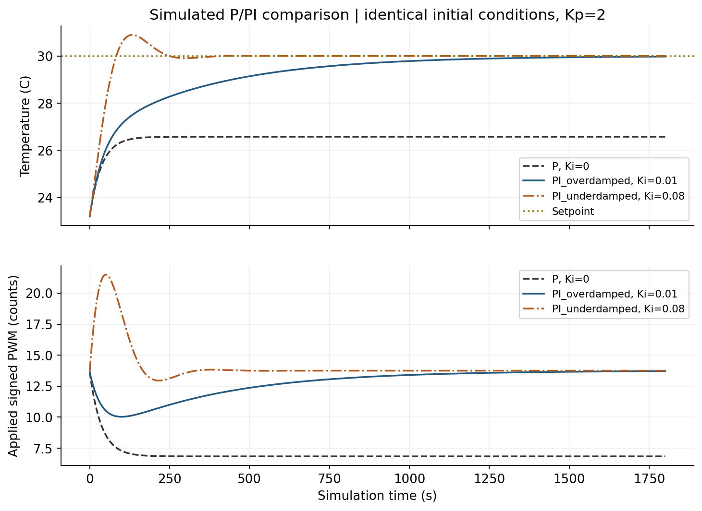

# A3: Feedback Data and Lumped-Model Memo — INCOMPLETE DRAFT

Ricky Huang and Xavier Zhu · Phys 39 · 2026-10-07

**This is a draft for completing the assignment, not a submission-ready paper.** No matched physical PI data or verified instability threshold is available. Calibration values retain their documented provisional status. Final PDF: `A3_Huang_Zhu.pdf`; each student separately submits to Moodle by October 21, 2026, 6:00 PM.

## 1. P feedback and the thermal model

The one-lump energy balance is C dT/dt = Pu u − H(T−Tamb), where C is J/°C, Pu is W/PWM count and H is W/°C. At steady state, T=Tamb+(Pu/H)u, so χ=Pu/H. With u=Kp(Tset−T), collecting temperature terms gives (1+χKp)T=Tamb+χKpTset. Therefore droop=(Tset−Tamb)/(1+χKp). At a nonambient setpoint, zero P error means zero TEC command while environmental exchange remains nonzero, so a finite sustaining error is required. Doubling Pu doubles χ; doubling H halves χ; doubling C changes τ=C/H but not steady droop. L=χKp is dimensionless.

The provisional Module 4 fits give χh=0.49545 and χc=0.14142 °C/PWM. The heating branch applies to the Module 5 30 °C runs with ambient reference 23.1885 °C. The smallest gain has L≈0.124; gains at L≈1 or higher should not be described as small.

| Kp (PWM/°C) | L | Measured droop (°C) | Predicted droop (°C) | Measured droop / initial offset | 1/(1+L) | Predicted τcl (s) |
| --- | --- | --- | --- | --- | --- | --- |
| 0.2500 | 0.1239 | 6.0000 | 6.0608 | 0.8809 | 0.8898 | 64.9790 |
| 0.5000 | 0.2477 | 5.2300 | 5.4592 | 0.7678 | 0.8015 | 58.5285 |
| 1.0000 | 0.4954 | 4.5022 | 4.5549 | 0.6610 | 0.6687 | 48.8332 |
| 2.0000 | 0.9909 | 3.2305 | 3.4213 | 0.4743 | 0.5023 | 36.6807 |
| 4.0000 | 1.9818 | 2.2600 | 2.2844 | 0.3318 | 0.3354 | 24.4912 |

Measured final-20-s droop decreases from 6.00 to 2.26 °C as Kp rises from 0.25 to 4 PWM/°C. Model deviations are approximately 0.025–0.229 °C. Local susceptibility, integer PWM, ambient variation and incomplete settling can contribute. The record reports no oscillation up to Kp=4; it does not establish an onset gain or oscillation frequency. **Required instability evidence remains to be added or its absence accepted by the instructor.**

## 2. Time constant and open-loop comparison

For H3, the first confirmed +34 PWM sample is at Arduino time 39.49 s, T0=25.10 °C. The endpoint mean is 40.4205 °C. The 63.2% threshold is 34.7844 °C; interpolated crossing gives τ≈73.03 s. Endpoint min/max sensitivity is 72.49–73.75 s, not a confidence interval. Six usable steps give 60.86–75.50 s, demonstrating model/experiment variation. The Arduino sources average 1000 ADC readings before conversion; each CSV does not independently identify the uploaded firmware.

Only C/H and Pu/H are measured. H=1 W/°C is an arbitrary equivalent simulation scale, giving C=73.0274 J/°C, Pu,h=0.495446 W/PWM and Pu,c=0.141417 W/PWM; these are not independently measured thermal constants.

| Run | Signed PWM | Predicted final (°C) | Measured endpoint (°C) | Trace RMSE (°C) |
| --- | --- | --- | --- | --- |
| H3 | 34 | 40.2852 | 40.4205 | 0.1802 |
| C1 | -24 | 20.0460 | 20.4428 | 0.4451 |

H3 supplied τ, so its transient comparison reuses calibration. C1 tests transfer of that common τ, although its endpoint contributes to the cooling slope. Residual cooling mismatch illustrates full-range linear calibration and common-time-constant limitations. The existing Module 4 approximately 3τ plus one-minute steady-state audit remains unresolved for several calibration points.

## 3. Simulated P/PI and gain interpretation

The ideal P model has τcl=τ/(1+χKp) and a single real negative eigenvalue. It approaches equilibrium monotonically. A second thermal mass with finite coupling is a plausible apparatus extension; these data do not uniquely identify its role. PI adds q̇=e and u=Kp e+Ki q. At unsaturated steady state e=0 and the retained integral state supplies the sustaining PWM. Its second-order dynamics can be underdamped.

The official v3 one-lump simulations use identical initial conditions, q(0)=0, Kp=2, setpoint 30 °C, ambient 23.1885 °C, dt=0.1 s and limit ±255, with anti-windup ON. Ki=0.01 gives ζ≈1.655; Ki=0.08 gives ζ≈0.585.

| Simulation | Ki (PWM/(°C·s)) | ζ (PI only) | Error at 1800 s (°C) | Overshoot (°C) | 10–90% target rise (s) | Target settling (s) |
| --- | --- | --- | --- | --- | --- | --- |
| P | 0 | not reached in recorded duration | 3.4213 | 0.0000 | not reached in recorded duration | not reached in recorded duration |
| PI_overdamped | 0.0100 | 1.6549 | 0.0234 | 0.0000 | 575.0448 | 1164.2000 |
| PI_underdamped | 0.0800 | 0.5851 | -0.0000 | 0.8960 | 62.3313 | 225.7000 |

All entries above are simulated. Errors are endpoints after 1800 s. Target rise time uses 10–90% of the initial setpoint offset; target settling uses ±0.13623 °C with every subsequent sample inside. P does not reach those targets. The larger Ki responds faster but overshoots by about 0.896 °C. These settings guide supervised exploration and are not verified hardware gains. Halving dt changes the main simulated temperatures by less than 0.004 °C.

## 4. Matched experimental P/PI — REQUIRED, PENDING

Insert matched **physical** P and PI temperature/PWM traces here. Both should use documented comparable initial conditions and setpoints. Record Kp, Ki, reset integral state, actual sample interval, limits, anti-windup and requested/applied commands. Existing Module 5 P recordings are reference evidence, not automatically a matched baseline for a future PI run.

| Physical case | Kp | Ki | Initial T | Setpoint | Limits / sample interval | Anti-windup | Rise / overshoot / settling / steady error / saturation | Source CSV |
| --- | --- | --- | --- | --- | --- | --- | --- | --- |
| Matched P baseline | pending | 0 | pending | pending | pending | pending | pending | pending |
| Matched PI | pending | pending | pending | pending | pending | pending | pending | pending |

Document which v3 result informed the selected hardware gains, what changed while tuning, and why the chosen gains are supported by the measured traces. Instructor review of control calculations is required before actuator power.

## 5. Windup and model limitations

With unrestricted integration, persistent error continues increasing q during PWM saturation. Near the setpoint, that stored state can keep excessive drive applied, causing overshoot and delayed recovery. Conditional integration skips error accumulation that pushes farther into saturation while allowing unwinding; output clamping remains active. Clearing the integral before comparisons makes controller initial conditions reproducible.

A simulation-only unreachable-setpoint test (60 °C to 30 °C at 400 s, limit 15 PWM) produces an integral contribution of about 983 PWM without anti-windup. Output stays saturated and temperature remains near 30.62 °C through 1400 s; conditional integration returns it near 30 °C. This is not a physical test. Real apparatus additionally has thermal gradients, sensor/controller lag, integer PWM and possible varying heat-loss conductance.

## 6. Reproducibility and checkpoint

- [Detailed derivation, methods and remaining work](../module_notes/module_06_p_pi_model.md)
- [Unchanged official v3 program](../../python/Lab_6_7_modeling_tec_v3.py)
- [Analysis script](../../python/analysis/module_06_analysis.py)
- [Executed notebook](../../python/analysis/module_06_analysis.ipynb)
- [Exact model settings, numeric results and input hashes](../../data/module_06/analysis_results.json)
- [Module 4 input summary](../../data/module_04/steady_state.csv)
- [Module 5 input summary](../../Module_5/data/part_04_droop_comparison.csv)
- GitHub modeling checkpoint: **pending commit, push and verification**.

Run from repository root: `.venv/bin/python python/analysis/module_06_analysis.py`.

AI assisted with calculations, plots and draft writing. The team must review the reasoning and supply actual physical-controller evidence before final submission.
