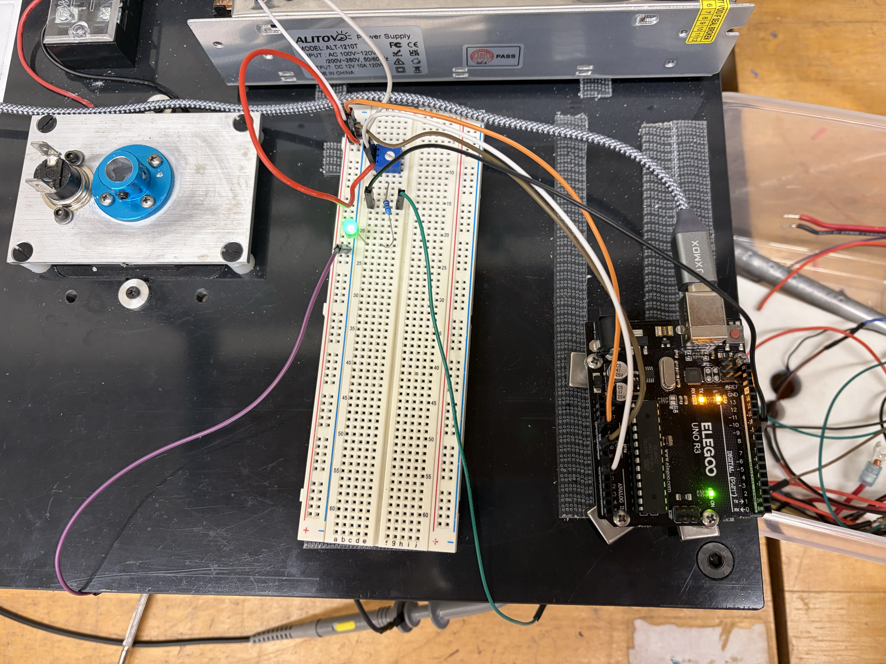
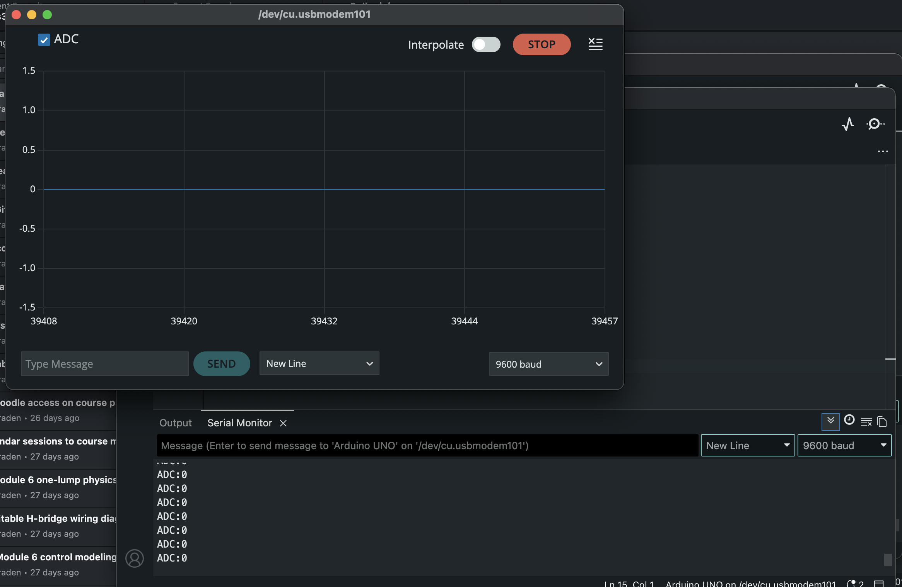
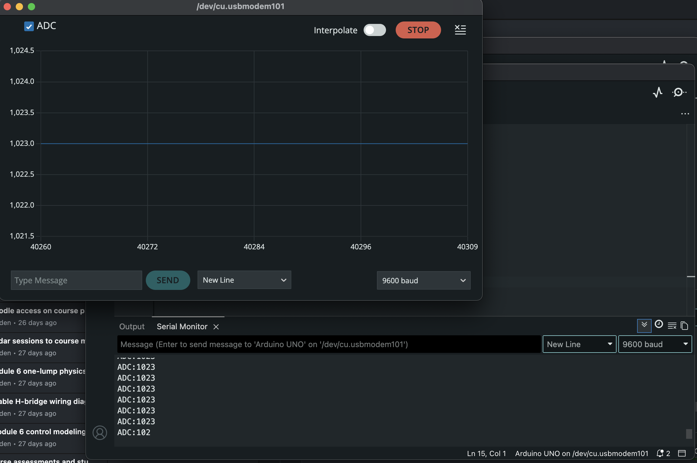
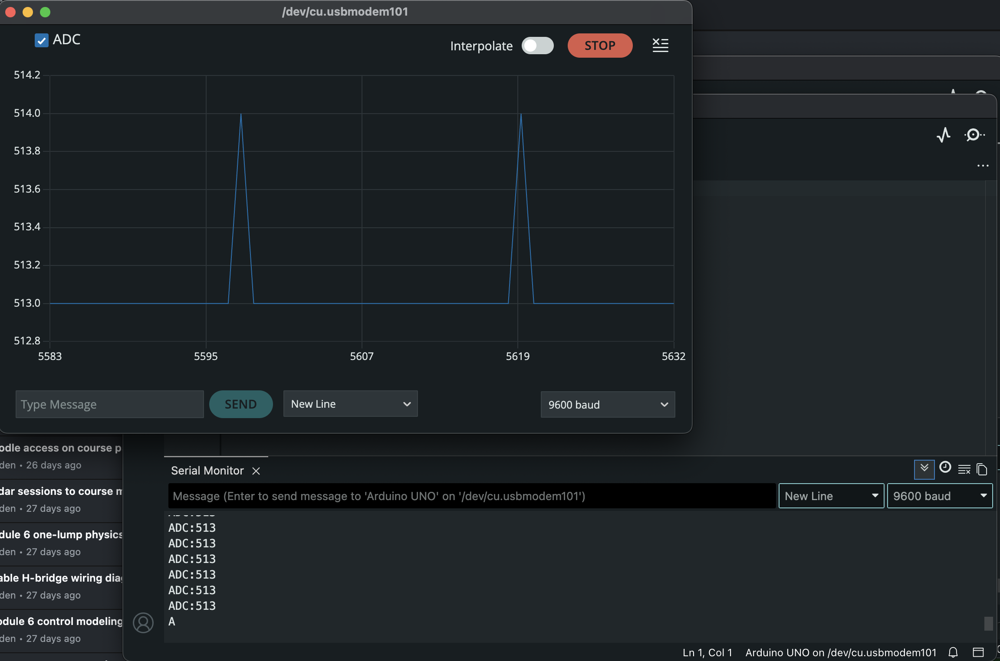
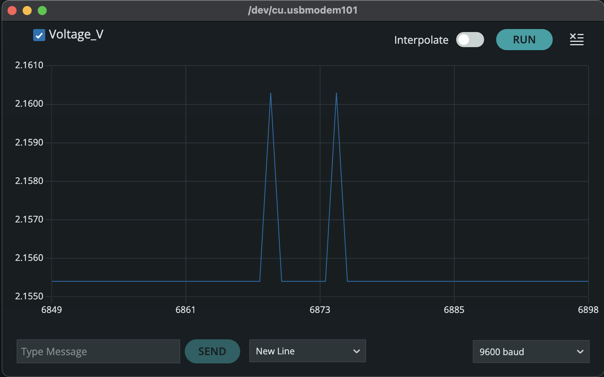
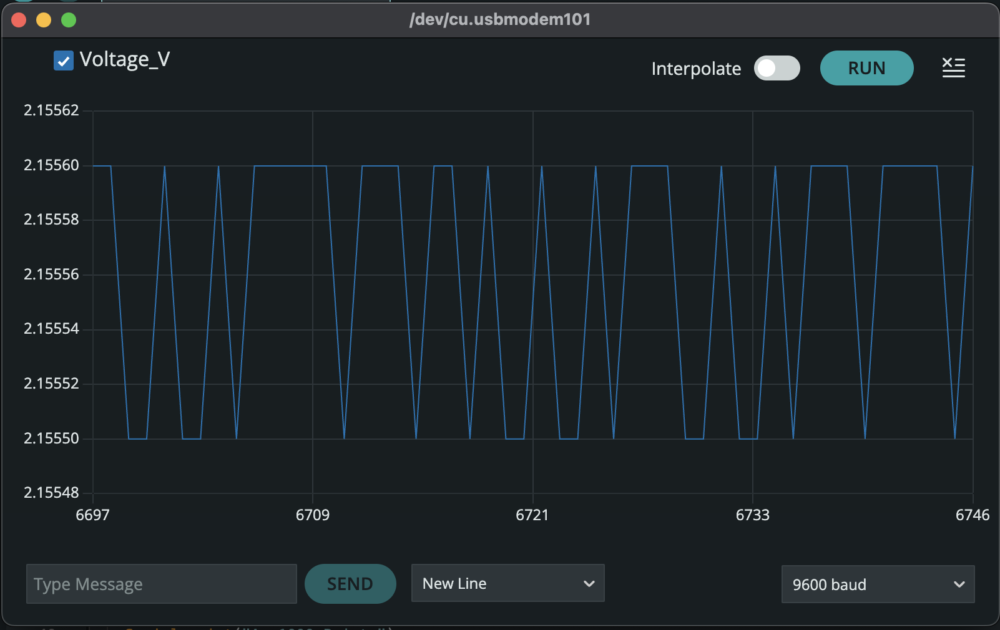
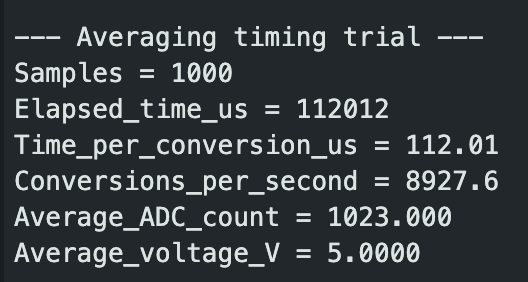
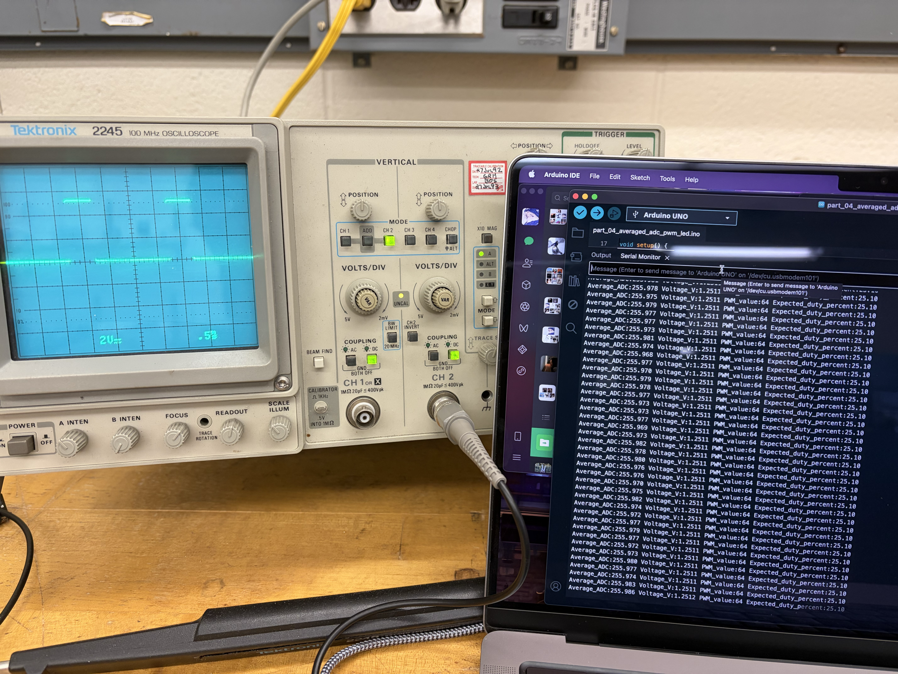
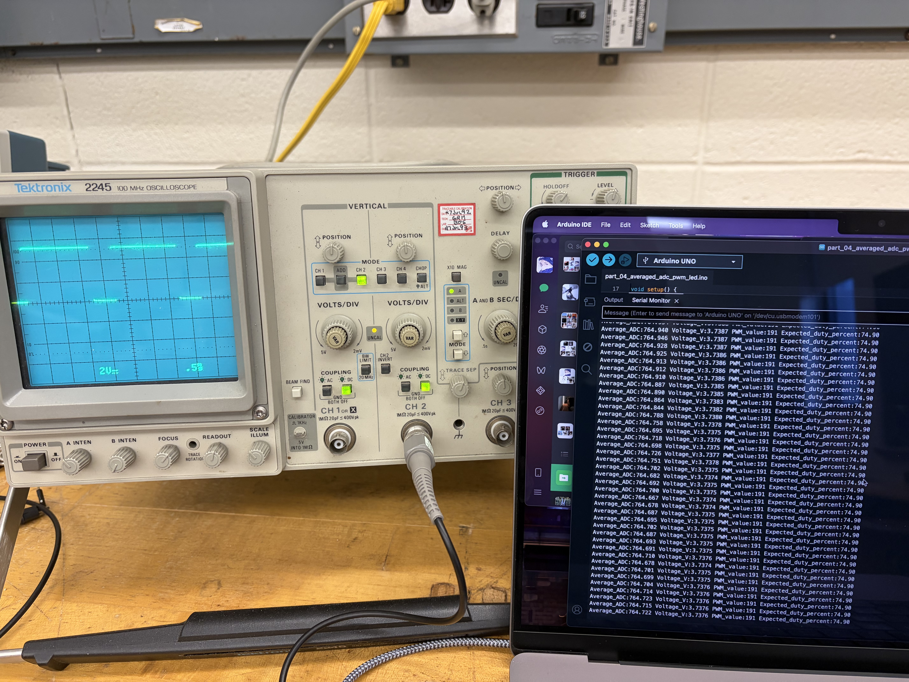

# A1: Module 1 Evidence Note

**Team members:** Ricky Huang and Xavier Zhu  
**Date:** September 4, 2026  
**Repository:** [Phys 39 Team R&X](https://github.com/zhuyanheng/Phys39-teamR-X)  
**Evidence checkpoint commit:** `01aa2cce9cb114c7de0d19125ac2fab9cc9e0e87`

---

## 1. Apparatus and Hardware Configuration

The Module 1 experiments used the following equipment:

- Arduino Uno
- 100 kΩ potentiometer
- LED
- Current-limiting resistor
- Breadboard
- Jumper wires
- Oscilloscope and probe
- Computer running Arduino IDE

For the ADC measurements, the potentiometer was connected as a voltage divider. One outer terminal was connected to Arduino 5 V, the other outer terminal was connected to Arduino GND, and the center wiper was connected to analog input A0.

For the PWM measurement, Arduino pin 9 was used as the PWM output. The LED was connected in series with a current-limiting resistor. The oscilloscope probe measured the voltage at pin 9 relative to Arduino GND.

*Figure 1. Experimental apparatus showing Arduino Uno, breadboard, potentiometer, LED, and current-limiting resistor.*

The connection labels corresponding to the apparatus photograph are:

| Signal or component | Connection |
|---|---|
| Potentiometer supply | Arduino 5 V |
| Potentiometer return | Arduino GND |
| Potentiometer wiper | Arduino A0 |
| PWM output | Arduino digital pin 9 |
| LED path | Pin 9 through a current-limiting resistor and LED to GND |
| Oscilloscope probe tip | Arduino pin 9 |
| Oscilloscope ground clip | Arduino GND |

---

## 2. Arduino Code

The following Arduino sketches were used to produce the Module 1 results.

### Part 1: Blink and Digital Output

- [Blink with 1:1 HIGH:LOW ratio](../../Module_1/arduino/part_01_blink_1to1/part_01_blink_1to1.ino)
- [Blink with 1:10 HIGH:LOW ratio](../../Module_1/arduino/part_01_blink_1to10/part_01_blink_1to10.ino)
- [Blink with 10:1 HIGH:LOW ratio](../../Module_1/arduino/part_01_blink_10to1/part_01_blink_10to1.ino)

### Part 2: AnalogReadSerial

- [AnalogReadSerial](../../Module_1/arduino/part_02_analog_read_serial/part_02_analog_read_serial.ino)

### Part 3: ADC Digitization and Averaging

- [Part 3A: Integer ADC readings](../../Module_1/arduino/part_03a_adc_integer/part_03a_adc_integer.ino)
- [Part 3B: ADC-to-voltage conversion](../../Module_1/arduino/part_03b_adc_voltage/part_03b_adc_voltage.ino)
- [Part 3C: Averaging comparison](../../Module_1/arduino/part_03c_averaging_comparison/part_03c_averaging_comparison.ino)
- [Part 3D: ADC acquisition timing](../../Module_1/arduino/part_03d_averaging_timing/part_03d_averaging_timing.ino)

### Part 4: PWM LED Control

- [Averaged ADC PWM LED](../../Module_1/arduino/part_04_averaged_adc_pwm_led/part_04_averaged_adc_pwm_led.ino)

---

## 3. ADC Digitization Results

The potentiometer was turned to both ends of its range and then placed near the midpoint.

| Potentiometer position | Measured ADC value |
|---|---:|
| Minimum | 0 |
| Maximum | 1023 |
| Selected midrange | Primarily 513, occasionally 514 |

The calculated midpoint of the measured range is:

$$
n_{\text{mid}} = \frac{n_{\text{min}} + n_{\text{max}}}{2} = \frac{0 + 1023}{2} = 511.5
$$

The selected experimental setting near ADC code 513 was reasonably close to this calculated midpoint.

### ADC Minimum

*Figure 2. Serial Plotter and Serial Monitor showing the minimum ADC output of 0.*

### ADC Maximum

*Figure 3. Serial Plotter and Serial Monitor showing the maximum ADC output of 1023.*

### ADC Midrange

*Figure 4. ADC output near the selected midrange. The readings were primarily 513, with occasional transitions to 514.*

### One-Count ADC Resolution

The Arduino Uno has a 10-bit ADC, so it has:

$$
2^{10} = 1024
$$

possible output codes, numbered from 0 through 1023.

Using the nominal reference voltage $V_{\text{ref}} = 5.00\ \text{V}$, the nominal one-count ADC resolution is:

$$
\Delta V_{\text{ADC}} = \frac{V_{\text{ref}}}{2^{10}} = \frac{5.00 \ \text{V}}{1024} = 0.0048828125 \ \text{V}
$$

Therefore:

$$
\Delta V_{\text{ADC}} \approx 4.883 \ \text{mV/count}
$$

The ADC values occupy discrete levels because each conversion must return one of the 1024 integer codes. Even when the potentiometer is not being touched, small electrical fluctuations can cause the result to move between neighboring ADC codes. Printing more decimal places after converting the ADC value to voltage does not improve the physical resolution of a single ADC conversion.

Serial Monitor makes the exact sequence of integer readings easy to inspect. Serial Plotter makes changes, fluctuations, and discrete transitions over time easier to recognize, but individual numerical values are more difficult to read precisely.

---

## 4. Averaging Results

The Part 3C experiment compared:

1. 100 sequential voltage points obtained from one ADC conversion per point, $N = 1$.
2. 100 sequential voltage points obtained by averaging 1000 ADC conversions per point, $N = 1000$.

The numerical data and analysis are available here:

- [N=1 voltage data](../../Module_1/data/part_3c_N1_data.csv)
- [N=1000 averaged voltage data](../../Module_1/data/part_3c_N1000_data.csv)
- [Part 3C quantitative analysis](../../Module_1/data/analysis_3c_ab.md)

### Serial Plotter Evidence

*Figure 5. Serial Plotter output for single-reading voltage measurements, $N = 1$.*

*Figure 6. Serial Plotter output containing only the 1000-reading averaged voltage measurements, $N = 1000$.*

### Statistical Comparison

The mean voltage was calculated using:

$$
\bar{x} = \frac{1}{n} \sum_{i=1}^{n} x_i
$$

The sample standard deviation was calculated using:

$$
s = \sqrt{ \frac{ \sum_{i=1}^{n} (x_i - \bar{x})^2 }{ n - 1 } }
$$

The results were:

| Potentiometer block | Reported points | Readings averaged per point $N$ | Mean voltage | Sample standard deviation $s$ | Measured $s/s_1$ | Predicted $s/s_1$ |
|---|---:|---:|---:|---:|---:|---:|
| Unaveraged | 100 | 1 | 2.50752655 V | 1.54093 mV | 1.000 | 1.000 |
| Long average | 100 | 1000 | 2.50724583 V | 0.034438 mV | 0.02235 | 0.03162 |

The measured standard-deviation ratio was:

$$
\frac{s_{1000}}{s_1} = \frac{0.034438 \ \text{mV}}{1.54093 \ \text{mV}} = 0.02235
$$

The independent-noise prediction was:

$$
\frac{s_{1000}}{s_1} \approx \frac{1}{\sqrt{1000}} = 0.03162
$$

The measured precision-improvement factor was:

$$
\frac{s_1}{s_{1000}} = \frac{1.54093}{0.034438} = 44.745
$$

The corresponding measured effective bit gain was:

$$
b_{\text{measured}} = \log_2(44.745) = 5.484 \ \text{bits}
$$

The theoretical effective bit gain was:

$$
b_{\text{predicted}} = \frac{1}{2} \log_2(1000) = 4.983 \ \text{bits}
$$

The measured result was reasonably close to the theoretical estimate of approximately five additional effective bits. The difference between the measured and predicted ratios may result from finite sample size, ADC quantization, correlated electrical noise, slow drift, or reference-voltage variation.

### Minimum Discrete Voltage Jump

For the $N = 1$ block, the smallest nonzero voltage jump between subsequent points was:

$$
\Delta V_1 = 0.004887 \ \text{V} = 4.887 \ \text{mV}
$$

This is approximately one ADC count.

For the $N = 1000$ block, consecutive points 2 and 3 were:

$$
V_2 = 2.507239 \ \text{V}, \quad V_3 = 2.507243 \ \text{V}
$$

Their difference was:

$$
\Delta V_{1000} = 2.507243 \ \text{V} - 2.507239 \ \text{V} = 0.000004 \ \text{V}
$$

Therefore:

$$
\Delta V_{1000} = 4 \ \mu\text{V} = 0.004 \ \text{mV}
$$

Averaging can produce reported values with sub-LSB numerical spacing because the mean of many integer ADC codes does not have to be an integer. However, the observed 4 µV numerical step should not be interpreted as 4 µV absolute accuracy. The sample standard deviation is a more meaningful empirical measure of noise-limited precision.

---

## 5. ADC Acquisition Time

The acquisition time was measured using `micros()` immediately before and after a loop containing 1000 `analogRead(A0)` conversions.

The measured result was:

| Quantity | Measured value |
|---|---:|
| Number of conversions | 1000 |
| Elapsed time | 112012 µs |
| Elapsed time | 0.112012 s |
| Time per conversion | 112.01 µs/conversion |
| Conversion rate | 8927.6 conversions/s |

*Figure 7. Serial Monitor output showing the measured time for 1000 ADC conversions.*

The time per conversion was:

$$
t_{\text{conversion}} = \frac{112012 \ \mu\text{s}}{1000} = 112.012 \ \mu\text{s/conversion}
$$

The corresponding conversion rate was:

$$
R = \frac{1000 \ \text{conversions}}{0.112012 \ \text{s}} = 8927.6 \ \text{conversions/s}
$$

The measured result of approximately 112 µs per conversion is reasonably close to the Arduino reference value of approximately 100 µs per conversion.

Averaging improves precision because independent measurement fluctuations partially cancel. However, averaging 1000 readings requires approximately 0.112 s. Changes occurring during that interval are smoothed or delayed. Averaging therefore acts as a low-pass filter: it improves voltage precision but reduces time resolution.

---

## 6. Oscilloscope Results

### Blink: Digital Output Waveforms

For the three Blink sketches, the following values are expected values
calculated from the `delay()` timing in the sketches. They are not direct
oscilloscope measurements. Since the output is a digital square wave, the
expected high voltage is approximately 5.0 V and the expected low voltage is
approximately 0 V.

| Waveform | Setting | Expected high voltage | Expected low voltage | Expected period | Expected frequency | Expected duty cycle |
|---|---|---|---|---|---|---|
| Blink 1:1 | HIGH 500 ms, LOW 500 ms | ~5.0 V | ~0 V | 1.00 s | 1.00 Hz | 50.0% |
| Blink 1:10 | HIGH 100 ms, LOW 1000 ms | ~5.0 V | ~0 V | 1.10 s | 0.91 Hz | 9.09% |
| Blink 10:1 | HIGH 1000 ms, LOW 100 ms | ~5.0 V | ~0 V | 1.10 s | 0.91 Hz | 90.9% |

The expected values illustrate that digital output behaves as an on/off switch:
the voltage levels stay approximately fixed while the timing and duty cycle
change between configurations.

### PWM: LED Brightness Control

For the PWM measurements, the oscilloscope measured the output on pin 9 while the potentiometer was turned. Frequency was calculated from the measured period using:

$$
f = \frac{1}{T}
$$

Duty cycle was calculated using:

$$
D = 100\% \cdot \frac{t_{\text{HIGH}}}{T}
$$

For Arduino PWM, the expected duty cycle was calculated using:

$$
D_{\text{expected}} = 100\% \cdot \frac{\text{PWM value}}{255}
$$

The oscilloscope photographs were read using approximately 2 V/div vertically
and 0.5 ms/div horizontally. The observed period occupied about four horizontal
divisions, giving an approximate measured period of 2.0 ms and frequency of
500 Hz.

| Waveform | Setting | Measured high voltage | Measured low voltage | Measured period | Measured frequency | Measured duty cycle | Expected duty cycle |
|---|---|---|---|---|---|---|---|
| PWM low setting | PWM value 64 | ~5.0 V | ~0 V | ~2.0 ms | ~500 Hz | ~25% | 25.10% |
| PWM high setting | PWM value 191 | ~5.0 V | ~0 V | ~2.0 ms | ~500 Hz | ~75% | 74.90% |

The approximate frequency calculated from the oscilloscope period was:

$$
f = \frac{1}{2.0 \times 10^{-3}\ \text{s}} \approx 500\ \text{Hz}
$$

Within the uncertainty of reading the oscilloscope graticule, this result is
consistent with the expected Arduino Uno pin 9 PWM frequency of approximately
490 Hz, corresponding to an expected period of approximately 2.04 ms.

*Figure 8. Pin 9 PWM waveform at PWM value 64. The oscilloscope shows approximately 0 V to 5 V pulses, a period of about 2.0 ms, and a duty cycle of about 25%.*

*Figure 9. Pin 9 PWM waveform at PWM value 191. The oscilloscope shows approximately 0 V to 5 V pulses, a period of about 2.0 ms, and a duty cycle of about 75%.*

Turning the potentiometer changed the PWM value and duty cycle. The PWM frequency, period, high voltage, and low voltage remained approximately constant. Increasing the duty cycle increased the fraction of each period during which the LED received current, making the LED appear brighter.

### Oscilloscope Compared With the Serial Displays

The oscilloscope directly measured the electrical voltage at Arduino pin 9 and resolved the individual high and low pulses. It showed the waveform period, pulse width, frequency, voltage levels, and duty cycle. In contrast, Serial Monitor and Serial Plotter displayed values selected, calculated, and reported by the software rather than directly measuring the output waveform. The serial displays showed the sampled potentiometer voltage and commanded PWM value, but they did not directly show the fast electrical switching of the PWM signal.

Although the oscilloscope showed that the LED repeatedly switched on and off, the LED appeared continuously illuminated because the PWM frequency was much higher than the ordinary 50–60 Hz flicker-fusion range. The exact visual threshold depends on brightness, contrast, peripheral vision, and viewing conditions.

---

## 7. Limitations and Uncertainty

The ADC analysis used the nominal 5.00 V Arduino reference rather than a separately calibrated reference voltage. Variation in the actual reference voltage therefore affects the absolute voltage accuracy.

Averaging improves random precision but does not remove systematic calibration
error. Correlated noise and slow drift can also cause the measured reduction in
standard deviation to differ from the ideal $1 / \sqrt{N}$ prediction.

Oscilloscope values estimated from the screen graticule have uncertainty from the trace width, scale reading, and cursor placement. The reported PWM values should therefore be interpreted as approximate measurements.

---

## 8. Reproduction Information

The Arduino sketches were tested using:

- Board: Arduino Uno
- Serial rate: 9600 baud
- Analog input: A0
- PWM output: pin 9
- ADC reference: 5.00 V nominal

To reproduce a measurement:

1. Open the relevant linked `.ino` file in Arduino IDE.
2. Select Arduino Uno as the board.
3. Select the correct serial port.
4. Verify and upload the sketch.
5. Open Serial Monitor or Serial Plotter at 9600 baud when required.
6. For PWM measurements, connect the oscilloscope probe to pin 9 and the ground clip to Arduino GND.
7. Compare the resulting measurements with the linked data and figures.
