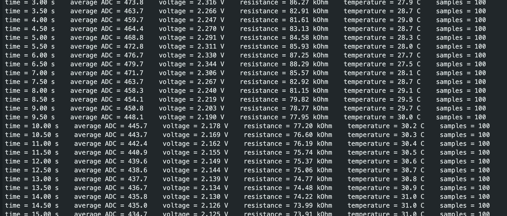
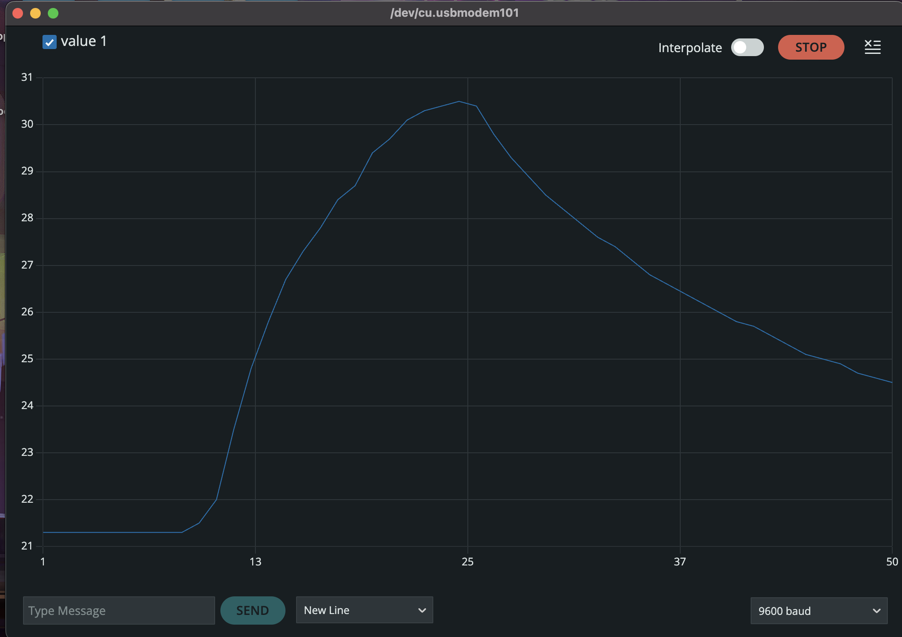
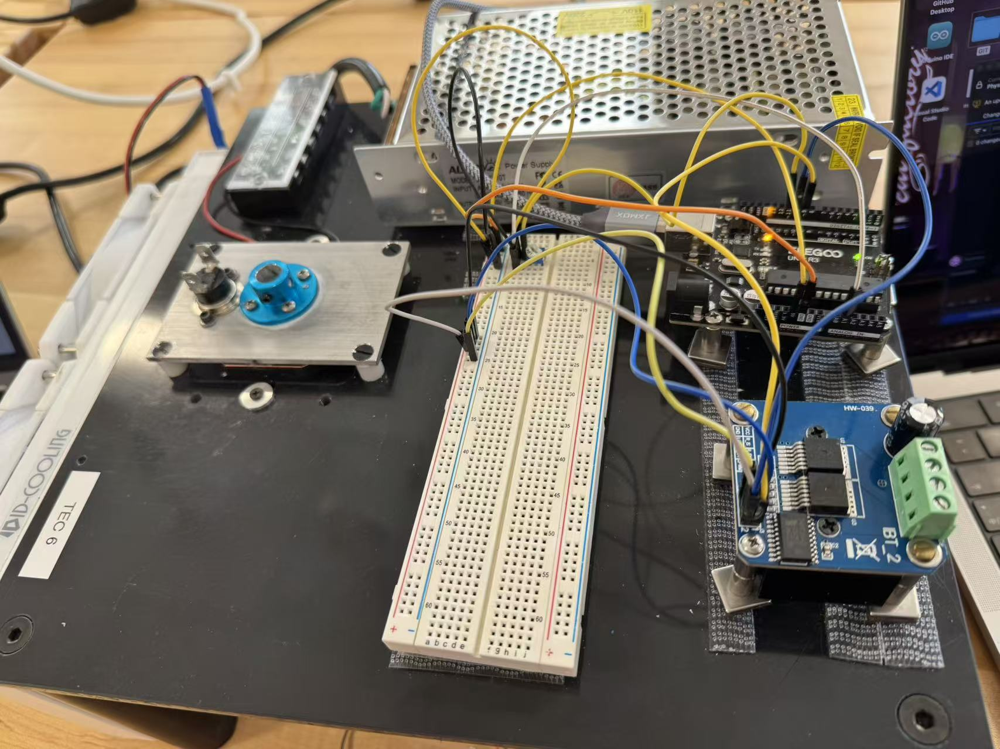
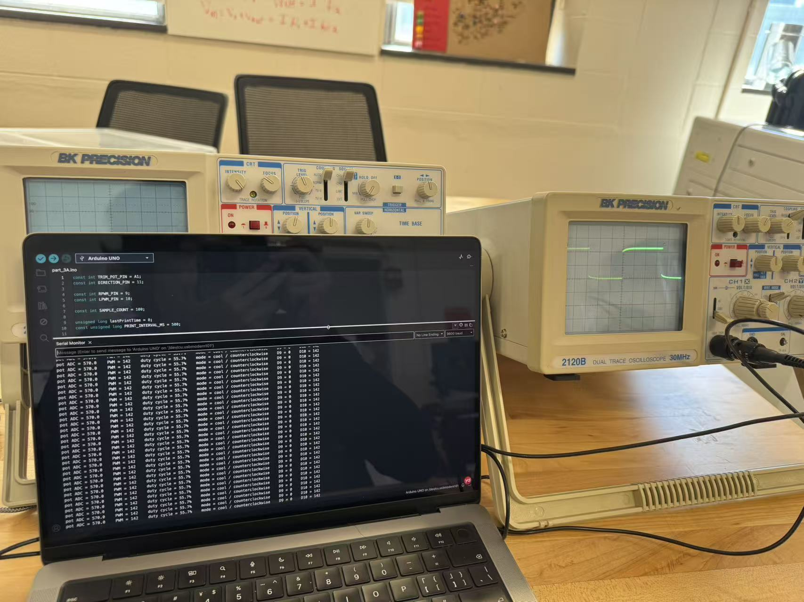
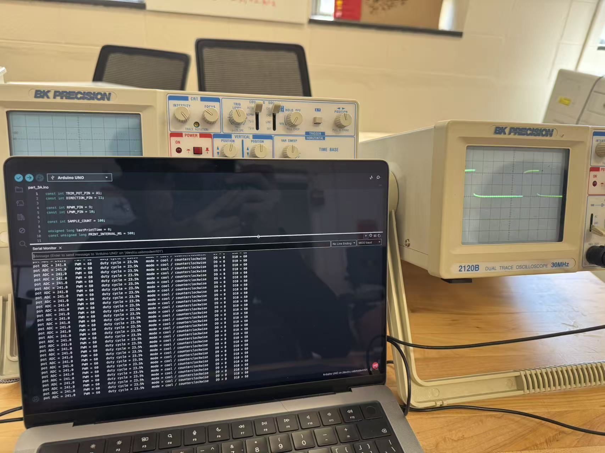
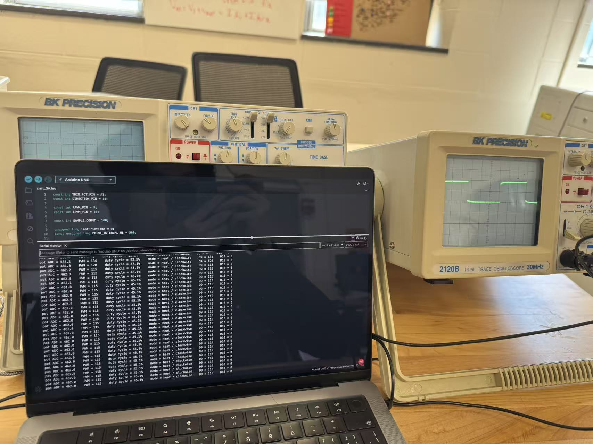
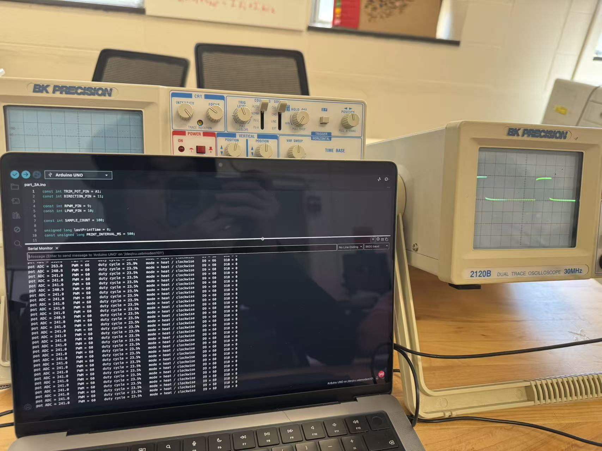
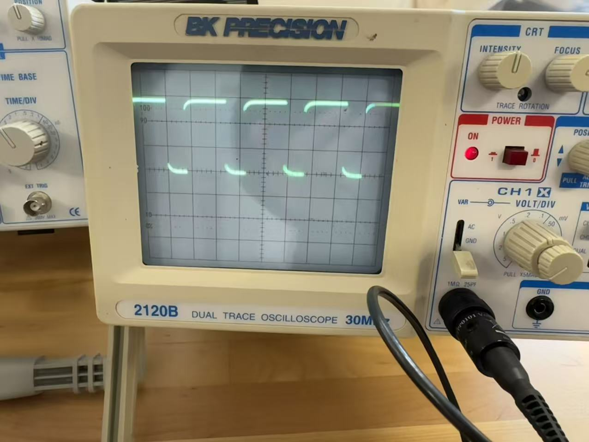

# Module 2 Instrument Pieces: C2 Evidence Note

**Course:** Phys 39  
**Module:** 2 - First Real Instrument Pieces  
**Session:** S4 (Wednesday, September 9)  
**Demo:** S6 (Wednesday, September 16)  
**C2 Rubric Alignment:** Measurement And Actuator Electronics

---

## 1. Thermistor Temperature Measurement (Part 1)

### 1.1 Thermistor Divider Circuit and Constants
The thermistor voltage divider is wired to Arduino 5V, A0, and GND.
*   **Circuit:** 5V -> Fixed Resistor ($R_{fixed}$) -> A0 -> Thermistor ($R_{therm}$) -> GND.
*   **Arduino Pin:** A0
*   **Conversion Chain:** `average ADC` $\rightarrow$ `average voltage` $\rightarrow$ `thermistor resistance` $\rightarrow$ `temperature`.

**Constants used in the sketch:**
*   $V_{REF} = 5.00 \text{ V}$
*   $R_{fixed} = 100,000 \ \Omega$ (100 k$\Omega$)
*   $R_0 = 100,000 \ \Omega$ (Nominal thermistor resistance at 25°C)
*   $T_0 = 298.15 \text{ K}$ (25°C in Kelvin)
*   $\beta = 4540 \text{ K}$ (Beta parameter from TDK/EPCOS B57861S0104F040V24 datasheet)
*   `SAMPLE_COUNT = 100` (Averaging between 100-1000 raw ADC readings)

**Conversion Equations (Beta Model):**
$$
V_{out} = \frac{\text{Average ADC}}{1023.0} \times V_{REF}
$$
$$
R_{therm} = R_{fixed} \times \frac{V_{out}}{V_{REF} - V_{out}}
$$
$$
\frac{1}{T} = \frac{1}{T_0} + \frac{1}{\beta} \ln\left(\frac{R_{therm}}{R_0}\right)
$$
$$
T(^\circ C) = \frac{1}{T} - 273.15
$$

### 1.2 Human-Readable Serial Output
Three representative lines from the Part 1 Arduino output (saved from `part_1.png`):
```text
time = 3.00 s    average ADC = 473.8    voltage = 2.316 V    resistance = 86.27 kOhm    temperature = 27.9 C    samples = 100
time = 5.00 s    average ADC = 468.8    voltage = 2.291 V    resistance = 84.58 kOhm    temperature = 28.3 C    samples = 100
time = 10.00 s   average ADC = 445.7    voltage = 2.178 V    resistance = 77.20 kOhm    temperature = 30.2 C    samples = 100
```

### 1.3 Serial Plotter Warming/Cooling Record
*   **Code change for Part 2:** Removed all text labels and units from `Serial.println()`. Changed output to only print `temperatureC, 1` (one decimal place) per line.
*   **Serial Plotter:** Plotted temperature vs. serial read order.
*   **Observation:** Warming the thermistor (holding between fingers) caused the plotted temperature to rise. Cooling it (slightly moistened finger) caused it to fall in the expected direction.

*Evidence:*



---

## 2. Trim-Pot PWM and H-Bridge Verification (Part 3A & 3B)

### 2.1 Trim-Pot to PWM Signal Path
*   **Signal Path:** `Trim-pot voltage (A1)` $\rightarrow$ `analogRead average` $\rightarrow$ `map(0-1023 to 0-255)` $\rightarrow$ `analogWrite` $\rightarrow$ `H-bridge input`
*   **Direction Input:** Pin 11 used as a digital input (5V = Heat/Clockwise, 0V = Cool/Counterclockwise).

### 2.2 Completed H-Bridge Heat/Cool Signal Table
This table represents the verified logic (Method 2) from the 3B oscilloscope checks:

| Arduino Pin 11 (Direction) | Mode | Arduino Pin 9 (RPWM) | Arduino Pin 10 (LPWM) |
| :--- | :--- | :--- | :--- |
| **5V (HIGH)** | Heat / Clockwise | **PWM Signal** (Active) | **0V** (Inactive) |
| **0V (LOW)** | Cool / Counterclockwise | **0V** (Inactive) | **PWM Signal** (Active) |

### 2.3 Oscilloscope Evidence for Active PWM Pins (3B)
*Safety Check:* Actuator power was OFF, TEC disconnected. Scope ground clips connected to Arduino GND.
*   **Voltage Level:** Logic HIGH $\approx$ 5V, Logic LOW $\approx$ 0V.
*   **Frequency:** $\approx$ 490 Hz (standard Arduino Uno PWM frequency).
*   **Duty Cycle Verification:** The duty cycle visually matched the commanded PWM value. When the inactive side was checked, it stayed strictly at 0V.

*Evidence:*






---

## 3. DC Motor Drive (Part 3C)

### 3.1 Motor Direction and PWM Speed Observations
*   **Wiring:** 12V power supply connected directly to B+/B-. Motor connected to M+/M- via isolated paired positions. TEC remained disconnected.
*   **Motor Direction:**
    *   Heat (Pin 11 = 5V): Motor spun **Clockwise**.
    *   Cool (Pin 11 = 0V): Motor spun **Counterclockwise**.
*   **PWM Speed Response:** Varying the trim-pot from 0 to 255 successfully varied the motor speed from a slow crawl to full speed. The tape flag on the shaft provided clear visual confirmation of speed changes.

### 3.2 M+ and M- Oscilloscope Waveforms
*   **Probe Grounding:** The oscilloscope ground clip was connected to **Arduino GND** for all measurements. (Explicitly: Never connected to M+ or M-).
*   **Waveform Comparison:**
    *   In Heat/Clockwise mode, M+ showed the PWM waveform while M- stayed at 0V.
    *   In Cool/Counterclockwise mode, M- showed the PWM waveform while M+ stayed at 0V.
    *   The waveforms swapped roles perfectly when the direction switch was flipped, confirming correct H-bridge output logic.

*Evidence (Note: Video recording had an issue, so a supplementary image is provided):*

*[Link to 3C Video](../../Module_2/figures/part_3c.mp4)*

---

## 4. Authoritative Arduino Sketches
The exact Arduino sketches used for this module are stored in the repository. 
*   [Part 1: Thermistor Serial Data and Temperature Conversion](../../Module_2/arduino/part_1)
*   [Part 2: Serial Plotter Output](../../Module_2/arduino/part_2)
*   [Part 3: Trim-Pot, H-Bridge, and Motor Control](../../Module_2/arduino/part_3)

## 5. Individual Explanation & Verification (C2 Rubric Prep)
*   **Divider Conversion:** Explained the chain of averaging ADC readings first, then converting to voltage via $V_{out} = \text{ADC} \times \frac{5}{1023}$. Then applying the voltage divider formula to find $R_{therm}$, and finally using the Beta equation to get Celsius. Averaging first reduces noise before non-linear conversion.
*   **PWM:** Explained `map()` converting 10-bit ADC (0-1023) to 8-bit PWM (0-255) for `analogWrite`.
*   **Expected H-Bridge Inputs:** Explained that only ONE of the two PWM pins (9 or 10) should be active at a time to prevent shorting the H-bridge. Pin 11 acts as the direction selector, routing the PWM signal to either RPWM (Heat) or LPWM (Cool) while forcing the other to 0V.